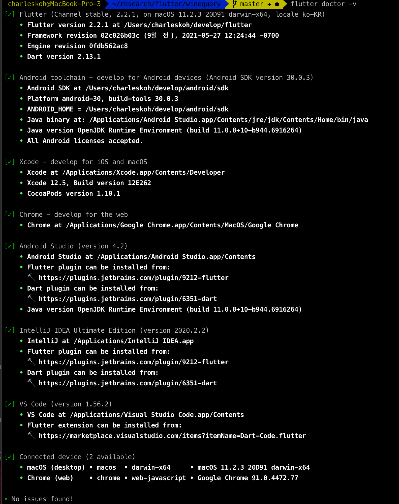
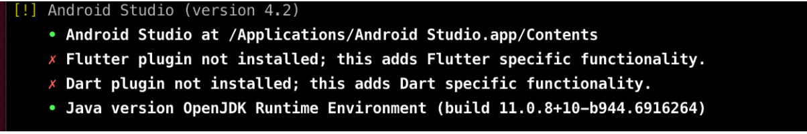

# winequery

A new Flutter project.


## 개발환경

|  구분        |  설명                                                 |
|--------------|-------------------------------------------------------|
| Dart     | 2.13.1 Stable   |
| Flutter    | 2.2.1   |
| Android Studio   | 4.2.1                                        |
| Xcode          | 12.5                                               | 


### IDE - Android Studio  

#### * 플러그인  
  > Android Studio > Preference > Plugins > "검색"
  - Dart: https://plugins.jetbrains.com/plugin/6351-dart
  - Flutter: https://plugins.jetbrains.com/plugin/9212-flutter
  

### 환경 체크  
  > 프로젝트 폴더 내에서 `flutter doctor -v` 명령 실행  
      

  
  - 오류 발생 시 
      
    `flutter channel dev`   
    `flutter upgreade`  


### 프로젝트 시작  
  - 소스코드 복사(clone)  
    
  - 초기 셋업  
    ```
    cd wineqyery
    dart pub get  
    flutter create .  // 프로젝트명(폴더)에 [a-z0-9_]외의 문자가 있는경우 --project-name 옵션을 이용해 프로젝트명을 지정해 준다.  
    ```  
  
  - 실행
    - `flutter run`  
  
    -  `Error: Cannot run with sound null safety, because the following dependencies` 오류  
       ```
       flutter run --no-sound-null-safety  
       ```

## 프로젝트 구조  
  ### Provider 패턴  
    1. 출처: 미디엄(medium.com)  
       https://medium.com/flutter-community/flutter-architecture-provider-implementation-guide-d33133a9a4e8  
  
       소스코드  
       https://github.com/FilledStacks/flutter-tutorials/tree/master/010-provider-architecture  
  
    2. GetIt
       > 비즈니스 로직을 분리하기 위해 GetIt 이라는 패키지를 추가로 사용 함. MVVM 구조 가능.  
       GetIt 사이트: https://pub.dev/packages/get_it  
       
  ### 폴더 구조  
    ```
    ├── README.md
    ├── android
    ├── ios
    ├── web
    ├── lib                                 // Dart 플랫폼 공통 코드
    │   ├── core            
    │   │   ├── enum
    │   │   │   └── viewstate.dart
    │   │   ├── model
    │   │   │   ├── user.dart
    │   │   │   ├── store.dart
    │   │   │   ├── ...
    │   │   │   └── wine.dart
    │   │   └── service
    │   │       ├── api.dart
    │   │       └── auth.service.dart
    │   ├── ui
    │   │   ├── router.dart                 // 화면전환 관리
    │   │   ├── shared                      // view 내에서 공통으로 사용할 수 있는 모든 잡다한 것들.. 
    │   │   │   ├── app.color.dart
    │   │   │   ├── text.style.dart
    │   │   │   └── ui.helper.dart
    │   │   ├── view                        // 화면(페이지) 단위  
    │   │   │   ├── base.view.dart
    │   │   │   ├── main.view.dart
    │   │   │   ├── purchase.view.dart
    │   │   │   ├── signin.view.dart
    │   │   │   ├── signup.view.dart
    │   │   │   └── winesearch.view.dart
    │   │   └── widgets                     // 화면 내에 작은 화면 단위  
    │   │       ├── storeregist.widget.dart
    │   │       └── wineregist.widget.dart
    │   ├── viewmodel                       // 비즈니스 로직
    │   │   ├── base.vm.dart
    │   │   ├── login.vm.dart
    │   │   ├── main.vm.dart
    │   │   ├── purchase.vm.dart
    │   │   ├── store.vm.dart
    │   │   └── wine.vm.dart
    │   ├── locator.dart
    │   └── main.dart
    ├── pubspec.lock
    ├── pubspec.yaml
    ├── screenshot
    │   ├── flutter_doctor_error.png
    │   └── flutter_doctor_v.png
    ├── test
    │   └── widget_test.dart
    └── winequery.iml
    ```  
    
## Backend 정보    
  ### Heroku 클라우드    
    - API 문서  
      https://winequery.herokuapp.com/docs  
    - 계정
  
  ### MongoDB 클라우드  
    - 계정
    - DB Connection  
      

---  
### 참고자료  
  - 시나리오  
    https://www.figma.com/file/5mwLuf5bvDibmBDTdGgd6e/%ED%94%8C%EB%9F%AC%ED%84%B0-%EC%99%80%EC%9D%B8-%ED%99%94%EB%A9%B4%EC%A0%95%EC%9D%98%EC%84%9C?node-id=0%3A1  
 
  - 데이터모델  
    https://www.erdcloud.com/d/CZbDibDEAzgmCvtnE  
 
  - 웹 크롤링
    https://drive.google.com/drive/u/4/folders/1CR8YFPi-coR3wPo_xwyTYCWBmmJn0mXu  
  
  - 아이디어 문서  
    https://docs.google.com/document/d/1_V3sT_vP2PYtV9bdQ3hPw4pVzBdk4EipekYkkHBatZc/edit  
    
    
    
